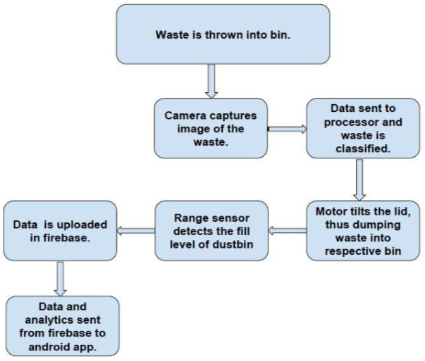

# TrashIt!
 "*Segregation of biodegradable and non-biodegradable waste using ML and IoT, all integrated in a garbage bin*" - with my team under [Team Envision at Aaruush, SRM IST](https://aaruush.net/callforaaruush/envision.html). (Prototype phase)

**Objective:**  
To efficiently automate the segregation of waste based on its type, i.e. biodegradable or not, in order to ensure proper waste disposal for healthier environment.

**Introduction:**  
TrashIt! is a waste management and disposal solution which is our eager initiative in order to ensure a cleaner and greener campus. It employs technology of Machine learning, IOT and an android app (frontend) to provide an easy waste disposal solution and show real time analytics for each trash bin nearby an area.  
TrashIt! Is a smart can which can classify biodegradable and non-biodegradable waste on it own and place that waste in different bins. The data collected during the trashing process is synchronized with an app interface to show relevant details of each dustbin and thereby sending a notification to the authorities whenever it gets filled.

**Need for the project:**  
Intelligent classification for recycling and disposal of waste around the university campus. It also depicts SRM's initiative towards Swachh Bharat Abhiyan.

**Methodology:**

**Implementation strategy:**
Our smart trash bin could be placed in various places around the campus. Java, UB, Tech Park canteens would be our prime targets.  
In the near future, we could also make a larger model which could manage massive amounts of waste generated by SRM mess everyday. Food waste could be dealt with at a large scale in the future. 

**Pros:**  
-Waste is classified as per its type.
-Manpower is reduced;the waste need not be sorted by a person.
-Fuel is saved.The content in each bin is analyzed and based on that, the call for transportation is made.  
**Cons:**  
-The model is costlier than a normal plastic dustbin.
-Mixed waste cannot be classified efficiently upto a certain extent.
-In order to classify the waste efficiently, the waste should be scanned in ample lighting conditions.
